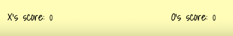

#  Cross Out Contest

Cross Out Contest is a classic two-player game, also known as Tic Tac Toe or Xs and Os. Players take turns to place their marker ('X' or 'O') on a 3x3 grid, aiming to get three of their markers in a row either horizontally, vertically, or diagonally.

## Table of Contents

1. [Technology Used](#technology-used)
2. [Color Palette](#color-palette)
5. [Features](#features)
6. [Game Logic](#game-logic)
7. [Deployment](#deployment)
8. [Credits](#credits)
   - [Content](#content)
   - [Media](#media)
   - [Acknowledgements](#acknowledgements)

### Technology Used

- **HTML** - For structuring the content of the game.
- **CSS** - Used for styling and enhancing the visual appearance.
- **JavaScript** - Powers the game mechanics and interactivity.

### Color Palette

The game uses a simple and elegant color palette to enhance the user experience:

- secondary-color: `#fffdb7`;
- primary-color: `#fff`;
- white-color: `white`;
- white-light-color: `#f1f1f1`;
- outline-color: `purple`;
- white-bakcground-light: `rgba(0, 0, 0, 0.7)`

### Features

## Existing Features

- __Cross Out Contest Logo and Heading__

  - Displayed prominently on the main page, this ensures that the user immediately recognizes the game.

- __Two Players Game__

  - Players can easily tap/click on a cell to play against another player.

- __Player Vs Computer__

  - Users can also play in player vs computer mode.

- __Whose Turn Box__

  - Whose-turn-box will kepp you updated whether it's your turn or it's the other player/computer's turn.

- __Score Tracker__

  - Always stay updated on who's leading with the score board that registers every win, loss, or tie.

- __Play Again and Exit Button__

  - You can leave the game in the middle and can restart the game all over again.

- __Result Pop Up__

  - The result pop up shows if the user has won, lost or the game is draw.

- __Tutorial Page__

  - There's a tutorial page for the users if they don't know the game rules. The pictorial representation makes it very understandable.

### Future Feature to be added

- Player vs Computer (Hard difficulty level)

## Testing

- The website works in different web browsers: Chrome, Firefox, and Microsoft Edge.
- On mobile devices, I tested the website site on a iPhone 12 Pro with safari browser and on Samsung Note 20.
- The website is responsive and functions on different screen sizes using the devtools device toolbar.
- The content on main page, player vs plyer, player vs computer and tutorial are interactive, easy to understand and responsive.

### Validator Testing 

- HTML
    - No errors were returned when passing through the official [W3C validator](https://validator.w3.org/nu/?doc=https%3A%2F%2Fcode-institute-org.github.io%2Flove-maths%2F)
- CSS
    - No errors were found when passing through the official [(Jigsaw) validator](https://jigsaw.w3.org/css-validator/validator?uri=https%3A%2F%2Fvalidator.w3.org%2Fnu%2F%3Fdoc%3Dhttps%253A%252F%252Fcode-institute-org.github.io%252Flove-maths%252F&profile=css3svg&usermedium=all&warning=1&vextwarning=&lang=en)
- JavaScript
    - No errors were found when passing through the official [Jshint validator](https://jshint.com/)
      - The following metrics were returned: 
      - There are 16 functions in this file.
      - Function with the largest signature take 2 arguments, while the median is 0.5.
      - Largest function has 15 statements in it, while the median is 3.
      - The most complex function has a cyclomatic complexity value of 17 while the median is 1.

### Game Logic

The game uses a 3x3 matrix to keep track of the board state. After each move, the game checks for a win condition or a draw. The game logic includes checks for horizontal, vertical, and diagonal wins.

### Deployment

The game can be deployed using various platforms like GitHub Pages, Netlify, or Vercel. For GitHub Pages:

1. Push your project to a GitHub repository.
2. Navigate to the 'Settings' tab of the repository.
3. Scroll down to the 'GitHub Pages' section.
4. Select the branch you want to deploy from and save.
5. Your site will be available at the provided GitHub Pages URL.

### Credits

#### Content

- The game logic and mechanics were inspired by the classic Tic Tac Toe rules.
- The design and interface concepts were crafted to provide players with an intuitive and enjoyable gameplay experience.

#### Media

- The game logo and other assets were sourced from the online free resources.
- Sound clips were sourced from Mixkit website.
